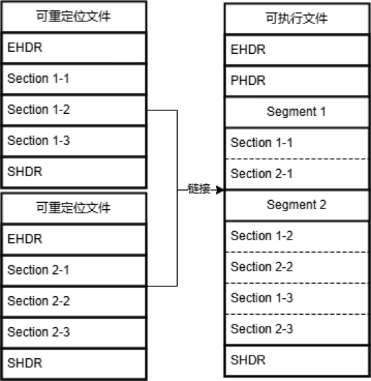
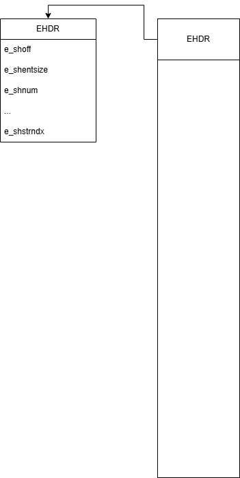
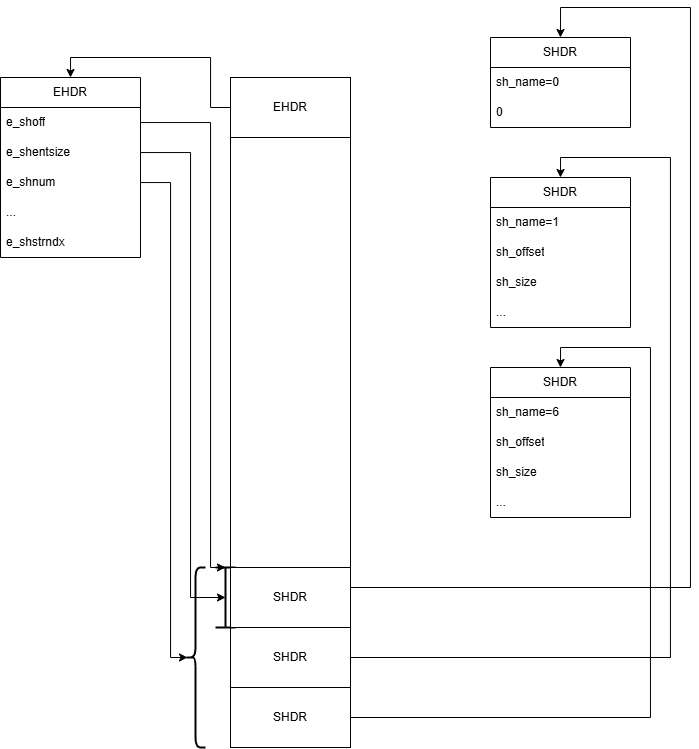
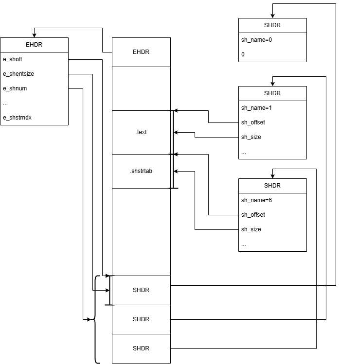
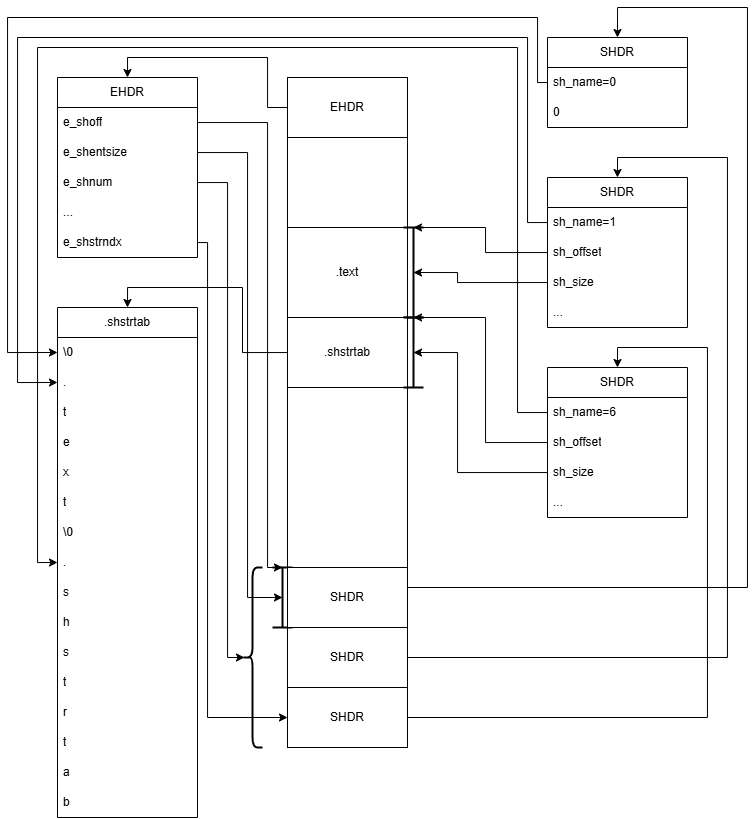

# READELF

## 目标

```asm
file : exit.c
section:
.text :
off  : 92
size : 16
.data :
off  : a8
size : 4
...

symbols :
local i : .data + 0 : 4
globl main : .text + 0 : 10
globl exit : UND
...
```

## ELF结构



## ELF规范

参考头文件`elf.h`
参考各架构abi规范

## 读取EHDR



## 读取SHDR



## 读取section



## 读取name


